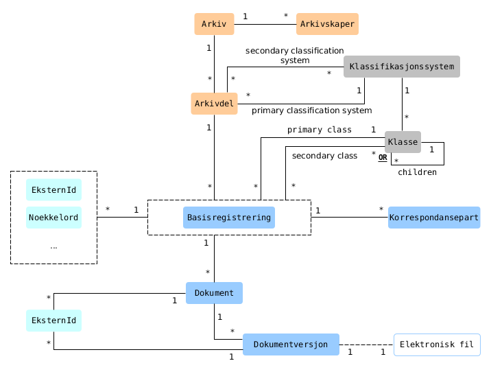
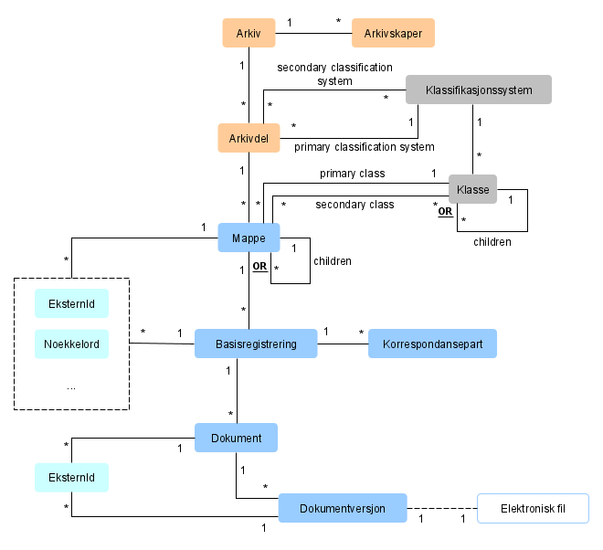

Archive models
-------

## Overview

This page describes several archive *models* that are based on the *metamodel* defined in [Noark 5 version 4](https://www.arkivverket.no/forvaltning-og-utvikling/noark-standarden/noark-5/noark5-standarden). Note that more archive models may be **added to this specification** and **existing models may be updated**. Such changes will maintain **backwards-compatibility** (in this major version of the web services).

By definition, Noark 5 systems must support at least one of these models and may mix models to allow for more flexible archiving. To archive into Documaster, you must first select the most appropriate model(s) for your use case.

## Archive model 1

- Suitable for archiving documents that do not require grouping in folders or case files
- Suitable for archiving incoming/outgoing communication where the documents do not require grouping in folders
- Classification of records is optional but strongly recommended

## Archive model 2

- Suitable for archiving documents that require grouping in folders
  - Folders must be used wisely, e.g. to group related documents together (but please consider if classification could be used instead).
  - **It is strongly discouraged to nest multiple levels of folders. Use classification instead!**
- Suitable for digitizing historic case files
- Classification is optional but strongly recommended

## Archive model 3

- Suitable for archiving incoming/outgoing communication in case files along with other documents
- Classification is mandatory

## Archive model 4

- Suitable for archiving meeting and board handling data in meeting folders along with other documents
- Classification is optional but strongly recommended

