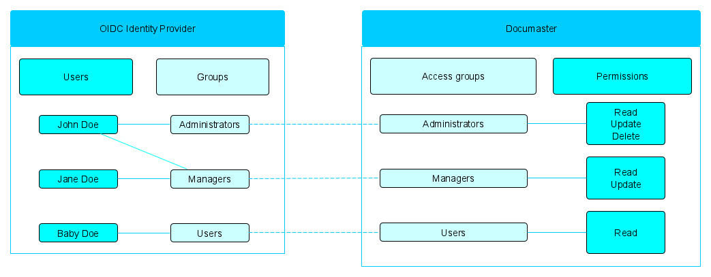

Access control
-------

# Introduction

This document provides information about the access control behavior. It will help you get acquainted with the employed group-based permissions management that could be set up with the help of Access groups and Explicit and Service permissions.

---

# Access control diagram



# Access control explained

The Documaster mandatory access control relies on access groups (defined in Documaster) in order to configure user access to the system. Users are assigned to access groups dynamically based on the user claims returned by the connected OpenID Connect identity provider. As a result, the Documaster access control is tightly coupled to the group membership setup in the configured OpenID Connect identity provider as each access group in Documaster is configured to map to one or more groups in the OpenID Connect identity provider.

By default, when creating a new Access group, that access group will have no access to the data in Documaster. In order for data to be readable, editable, or deletable by the group, "Explicit permissions" must be assigned to the desired entity types. Permissions are "inherited" meaning that the combination of the `ReadThis` and `Read` permission on a resource will make that resource __and all of its children__ (as described in the "Model") readable. The same applies to non-read permissions, such as `Create`, `Update`, etc.

To put this into perspective, in the diagram above:
* John Doe is a member of both "Administrators" and "Managers" in the OIDC IDP
* Jane Doe is a member of "Managers" in the OIDC IDP
* Baby Doe is a member of "Users" in the OIDC IDP

With the above (external to Documaster) configuration in place, one can create the following three access groups in Documaster:
* Administrators
* Managers
* Users

Based on the "claims" attributes of these access groups and considering the fact that the OIDC IDP returns information about the group membership to Documaster, Documaster is able to map the Documaster-based and the IDP-based groups together and grant the described permissions to each user.

# Access Control Types

## Access Group

An AccessGroup is identified by the following attributes:

| Attribute          | Data type    | Comment                                                                                |
|--------------------|--------------|----------------------------------------------------------------------------------------|
| id                 | long         | Unique identifier of the access group                                                  |
| name               | string       | Human-readable name of the access group                                                |
| description        | string       | Description of the access group                                                        |
| claims             | string array | External user claims upon which a user will be assigned as a member of an access group |
| globalPermissions  | string array | [Global permissions](#explicit-permissions)                                            |
| servicePermissions | string array | [Service permissions](#service-permissions)                                            |

## Explicit permissions

Explicit permissions can be read/set for certain entity types:

* Klassifikasjonssystem
* Klasse
* Arkiv
* Arkivdel
* Mappe (all types)
* Registrering (all types)

These take the form of `explicitPermissions` on the entity types and `globalPermissions` on the `AccessGroups`. The values read/set in that field determine the permissions assigned to an entity.

For entity types the `explicitPermission` can be specified using the rms/api/public/noark5/v1/permission/entity web services.

For code lists and values the `explicitPermission` can be specified using the rms/api/public/noark5/v1/permission/code-list web services.

For business-speicific metadata the `explicitPermission` can be specified using the rms/api/public/noark5/v1/permission/bsm-registry web services.

For AccessGroups the `globalPermissions` can be specified using the rms/api/public/noark5/v1/access-group web services.

The following `explicitPermissions`/`globalPermissions` can be used for entity types and access groups:

- `ReadThis`
  - grants permissions to members of the specified access group to read the current entity
- `Read`
  - grants permissions to members of the specified access group to read the children of the current entity (and the children of their children, etc.)
  - used together, `ReadThis` and `Read` grant access to the user of the specified group access to the whole archive (if used when creating access groups) or to the specified entity and all of its children
- `ReadRelated`
  - grants permissions to members of the specified access group to read objects related to access-controlling Code lists or Klassifikasjonssystemer
  - access-controlling Code lists and Klassifikasjonssystemer are managed using the rms/api/public/noark5/v1/access-modifier web services
- `Create`
  - grants permissions to members of the specified access group to create children of the current entity
- `Update`
  - grants permissions to members of the specified access group to update fields of the children of the current entity such as `tittel`, `beskrivelse`, etc.
- `Delete`
  - grants permissions to members of the specified access group to delete children of the current entity
- `Grant`
  - grants permissions to members of the specified access group to modify the permissions assigned to children of the current entity
- `UpdateSystemManaged`
  - grants permissions to members of the specified access group to update system attributes of the children of the current entity such as `oprettet*` fields
- `Move`
  - grants permissions to members of the specified access group to move children of the current entity to other parents

Note that new explicit permissions may be added in the future.

Supported explicit permissions for Arkiv, Arkivdel, Mappe (all types), Registrering (all types) are all explicit permissions listed above except `ReadRelated`.

Supported explicit permissions for Klassifikasjonssystem, Klasse are all explicit permissions listed above.

Supported explicit permissions for the `all` code list type are all explicit permissions listed above.

Supported explicit permissions for the `administrativenhet`, `mappetype`, `dokumenttype`, and `skjerming` code list types (and their list values) are only `ReadRelated`.

### Explicit permissions use cases

#### Users with global read access to the system

To grant users access to read everything in the archive, create or update their access group with the following explicit/global permissions:

- `ReadThis`
- `Read`
- `ReadRelated`

#### Global administrators of the system

To grant users access to read and edit everything in the archive, create or update their access group with the following explicit/global permissions:

- `ReadThis`
- `Read`
- `Create`
- `Update`
- `UpdateSystemManaged`
- `Move`

You could optionally grant `Delete`, but Documaster recommends that only a small number of people (if any) have rights to delete data in the archive.

You can add `ReadRelated` in case there are any access controlling Klasser or Code lists.

#### Global administrators of the system with rights to grant or revoke permissions to resources

To grant users access to read and edit everything in the archive, including permissions on resources, create or update their access group with the following explicit/global permissions:

- `ReadThis`
- `Read`
- `Create`
- `Update`
- `UpdateSystemManaged`
- `Move`
- `Grant`

You could optionally grant `Delete`, but Documaster recommends that only a small number of people (if any) have rights to delete data in the archive.

You can add `ReadRelated` in case there are any access controlling Klasser or Code lists.

#### Users with access only to a particular Fonds in the archive

To grant users access to read and edit everything only in a single Fonds in the archive, create or update their access group with the following explicit/global permissions:

- `ReadThis`

Additionally, update the Fonds you would like to grant them access to like so:

```json
POST rms/api/public/noark5/v1/permission/entity

{
    "groupId": long,
    "objectType": "Arkiv",
    "objectId": string,
    "explicitPermissions": ["ReadThis", "Read", "Create", "Update", "UpdateSystemManaged"]
}
```

You could optionally grant `Delete` on the Fonds, but Documaster recommends that only a small number of people (if any) have rights to delete data in the archive.

Additionally, you will need to repeat the same request for all Klassifikasjonssystemer to which the user needs to have access:

```json
POST rms/api/public/noark5/v1/permission/entity

{
    "groupId": long,
    "objectType": "Klassifikasjonssystem",
    "objectId": string,
    "explicitPermissions": ["ReadThis", "Read"]
}
```

You could optionally grant `Create`, `Update`, or `Delete` for the Klassifikasjonssystemer if you would like users to be able to create, edit, or delete existing Klasser.

Finally, you will need to repeat the same request for the BSM registry and all Code lists to which the user needs to have access:

```json
POST rms/api/public/noark5/v1/permission/bsm-registry

{
    "groupId": long,
    "explicitPermissions": ["ReadThis", "Read"]
}
```

```json
POST rms/api/public/noark5/v1/permission/code-list

{
    "groupId": long,
    "listType": "all",
    "explicitPermissions": ["ReadThis", "Read"]
}
```

## Service permissions

The service permissions attribute is found only on `AccessGroup`. The values of that attribute determine the types of actions members of an access group can perform in Documaster.

The following `servicePermissions` can be specified for `AccessGroup`:

- `Edit list values`
  - grants permissions to members of the specified access group to edit code list values
- `Journal`
  - grants permissions to members of the specified access group to journal Journalposter
- `Edit journaled`
  - grants permissions to members of the specified access group to edit journaled Journalposter
- `Dispose documents`
  - grants permissions to members of the specified access group to dispose documents
- `Edit finalized`
  - grants permissions to members of the specified access group to edit finalized entities
- `Publish documents`
  - grants permissions to members of the specified access group to publish documents in the Documaster Public Lookup Portal (if connected)
- `Store documents`
  - grants permissions to members of the specified access group to upload documents to the system
- `View changelog`
  - grants permissions to members of the specified access group to view the system changelog
- `Write changelog`
  - grants permissions to members of the specified access group to modify the system changelog
- `Security administrator`
  - grants permissions to members of the specified access group to manage the access groups in the system (create, update, and delete)
- `Store light PDF`
  - grants permissions to members of the specified access group to upload Light-weight PDF files for preview purposes in the UI
- `GUI administrator`
  - grants permissions to members of the specified access group to administer the Documaster UI

Note that new service permissions may be added in the future.
