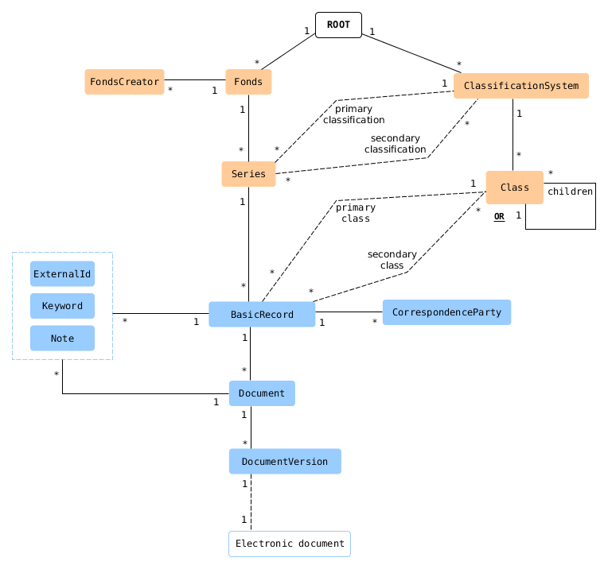
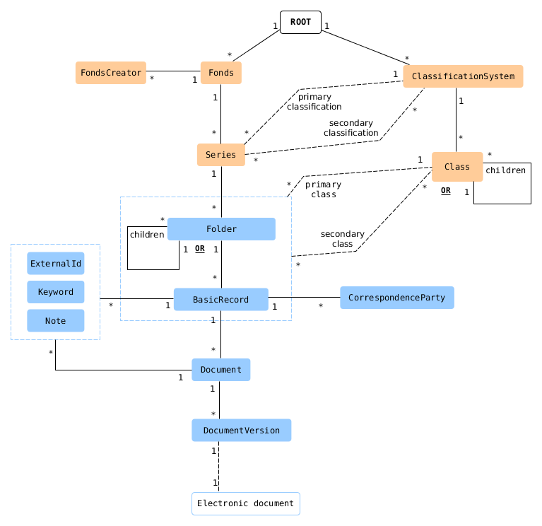
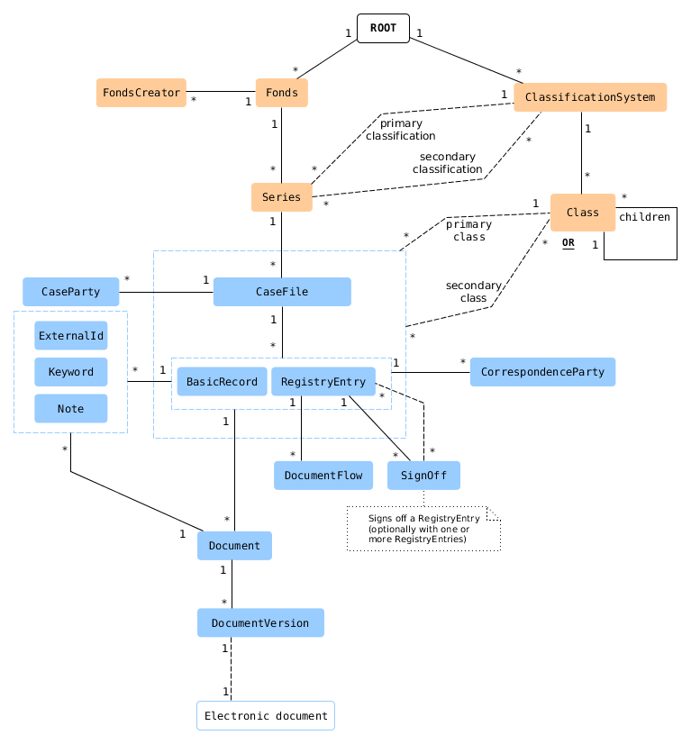
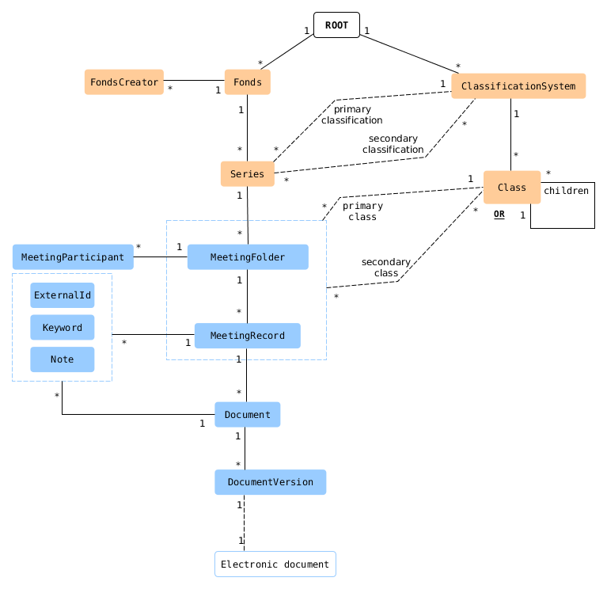

Standard object model
-------

# Introduction

This page describes the standard object model in Documaster which is based on the metamodel defined in the [Noark 5.5 standard for records management](https://www.arkivverket.no/forvaltning-og-utvikling/noark-standarden/noark-5/noark5-standarden). To store records in Documaster, you must first select one or more of the object model variants described below which best suit your needs.

# Object types overview

The following table outlines the key object types and what each type represents:

| Type                 | Description                                                                                                                                                                                                                             |
|:---------------------|:----------------------------------------------------------------------------------------------------------------------------------------------------------------------------------------------------------------------------------------|
| Fonds                | the set of all documents produced by an organization, agency, or individual; multiple fonds may co-exist in the same Documaster instance                                                                                                |
| FondsCreator         | organization, agency or individual who created and/or is responsible for a fonds                                                                                                                                                        |
| Series               | subdivision of fonds which groups specific records together because they relate to the same subject or function, result from the same activity, or document a specific kind of transaction; each series can have its own classification |
| ClassificationSystem | flat list or hierarchy of classes                                                                                                                                                                                                       |
| Class                | used to classify *Files* and *Records* to facilitate their retrieval                                                                                                                                                                    |
|                      |                                                                                                                                                                                                                                         |
| **File**             | *abstract* type representing Folder, CaseFile, or MeetingFolder (see below)                                                                                                                                                             |
| Folder               | collection of related records; nesting is allowed but strongly discouraged                                                                                                                                                              |
| CaseFile             | collection of records related to a (legal, medical, social work, etc.) case; nesting is not allowed                                                                                                                                     |
| MeetingFolder        | collection of records related to a meeting; nesting is not allowed                                                                                                                                                                      |
|                      |                                                                                                                                                                                                                                         |
| **Record**           | *abstract* type representing BasicRecord, RegistryEntry, or MeetingRecord (see below)                                                                                                                                                   |
| BasicRecord          | one or more documents which provide objective evidence of performed activities                                                                                                                                                          |
| RegistryEntry        | record of incoming/outgoing communication in a case file                                                                                                                                                                                |
| MeetingRecord        | record of meeting notes, decisions, etc.                                                                                                                                                                                                |
|                      |                                                                                                                                                                                                                                         |
| Document             | human readable metadata about a document such as title and description                                                                                                                                                                  |
| DocumentVersion      | version of a document                                                                                                                                                                                                                   |
| ExternalId           | tags objects (files, records, documents) with a unique identifier from an external system; used to locate objects originally created in other systems                                                                                   |

# Model variant 1

- Suitable for general-purpose records management where there is no need to group records together (other than at the series level)
- Classification is optional but strongly recommended

# Model variant 2

- Suitable for general-purpose records management where records share some common feature and must be grouped together (other than at the series level)
  - **Nested folders can be used to classify the underlying records, but this is strongly discouraged! Use classes instead.**
- Suitable when digitizing paper documents (as this often requires the digitized documents to be grouped together)
- Classification is optional but recommended

# Model variant 3

- Suitable for case management
- Classification is mandatory for case files

# Model variant 4

- Suitable for keeping meeting records
- Classification is optional but recommended

