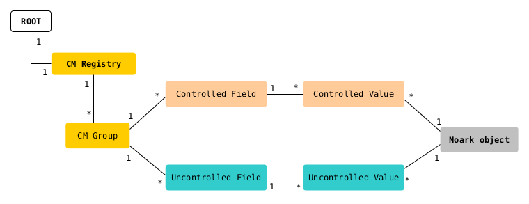

Custom metadata
---------------------------

# Overview

Many organizations have metadata needs that cannot be fully satisfied by the standard object model. For this reason, Documaster allows *custom metadata* to be defined and set on the following types of objects:

- Class
- Folder/CaseFile/MeetingFolder
- BasicRecord/RegistryEntry/MeetingRecord
- Document

# Custom metadata registry

Before setting custom metadata on an object, a template of the metadata must be defined in a special registry. The registry allows the following to be created:

- **Field**
   - Controlled field
      - Can have one of the following data types: string, long, double
      - Allows one to define a set of values (for the field) which can then be assigned to any number of objects from the standard object model
   - Uncontrolled field
      - Can have one of the following data types: string, long, double, timestamp
      - Allows one to assign any values for that field to any number of objects from the standard object model
- **Group**
   - Supports the logical grouping of related fields

