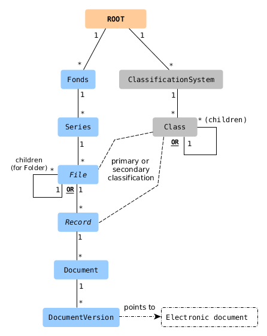

Access control model
---------------------
# Overview

Documaster distinguishes between two different types of permissions:

- **Object model permissions**
  - Control the access to objects and electronic documents
- **Service permissions**
  - Control the access to various functions in the system

All permissions in Documaster are **allow** permissions - i.e. everything is disallowed, unless explicitly allowed.

# Object model permissions

## Structural and label objects

The following diagram shows the types of objects to which permissions can be applied. These objects are known as *structural objects* because they form the structure of the archive. Objects not shown here are *label objects* and inherit their permissions from their sibling structural objects.



Notes:
- The permissions of an electronic document stored in the system are determined by the permissions of the DocumentVersion object that points to the document.

## Access control on objects

Controlling the access to an object requires an access group and a set of corresponding permissions to be associated with the object:

```
ACCESS_GROUP, PERMISSION_SET -> OBJECT
```

### Access groups

To be able to log in to Documaster, a user must be a member of at least one access group.

Access groups are created and managed in Documaster. A claim is associated with every access group upon its creation. If the claim is presented by the Identity Provider (IDP) after a user has been authenticated, the user will be considered to be a member of the corresponding access group:

```
IDP_CLAIM -> ACCESS_GROUP
```

### Permissions

The table below shows the permissions that can be set on objects, i.e. the explicit permissions:

| Permission            | Abbreviation | Applies to        | Description                                                                                           | Comment                                   |
|:----------------------|:------------:|:------------------|:------------------------------------------------------------------------------------------------------|:------------------------------------------|
| READ THIS             |      RT      | this object       | See an object and read all of its fields                                                              |                                           |
| READ                  |      R       | below this object | See an object and read all of its fields                                                              |                                           |
| UPDATE                |      U       | below this object | Update the fields of an object or add/remove a label object                                           |                                           |
| INSERT                |      I       | below this object | Insert a structural object under another object, whether newly created or moved from elsewhere        |                                           |
| MOVE                  |      M       | below this object | Move a structural object from one to another parent object                                            | MOVE+INSERT is required to move an object |
| DELETE                |      D       | below this object | Delete an object                                                                                      |                                           |
| GRANT                 |      G       | below this object | Add/remove permissions on an object                                                                   |                                           |
| UPDATE SYSTEM MANAGED |     USM      | below this object | Allow system-managed fields to be set to new values (overriding the default values set by the system) | &nbsp;                                    |

Note that:
- All permissions, except READ THIS, are inherited from *ROOT* down to DocumentVersion and from *ROOT* down to Class
- To read an object, a user must also be able to read all of its ancestors (following **all** paths) up to *ROOT*.
   - There are no READ and READ THIS effective permissions: the fact that an object can be read is represented simply with an effective READ permission.
- Being able to read an object is required for any other permission to take effect on that object.

# Service permissions

Service permissions control the access to functions in the system:

- Set global object model permissions (i.e. set permissions on the *ROOT* node)
- View the change log for all objects
- Store documents
- Dispose documents
- Store light PDFs
- Reopen finalized objects
